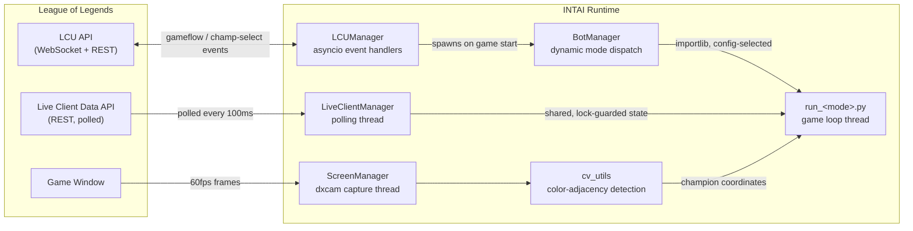

# INTAI

A Windows application that drives League of Legends' client and in-game APIs end-to-end (lobby creation, champion select, and live gameplay) using a real-time computer-vision pipeline built without any ML models or template matching.

> **Note:** This is a personal research project exploring real-time CV, async event-driven systems, and reverse-engineered client APIs. Running this program in a live game environment to automate gameplay violates the League of Legends Terms of Service.

## What it does

INTAI connects to two local League of Legends services and coordinates them through a shared, threaded runtime:

- **League Client Update (LCU) API**: an authenticated WebSocket/REST API exposed by the running client. INTAI subscribes to gameflow and champion-select events to drive lobby creation, matchmaking, ready-check, and pick/ban.
- **Live Client Data API**: a REST endpoint exposed by the game process itself during a match, polled for player/game state (health, level, events).
- **Screen**: captured directly via the GPU (DXGI desktop duplication) since neither API exposes champion positions on screen. A lightweight color-based vision routine locates player, ally, and enemy champions from health-bar pixel signatures in real time.

Those three data sources feed a per-game-mode automation loop (ARAM, Arena, Summoner's Rift) that decides when to attack, retreat, level abilities, shop, and reposition.

## Architecture



Each data source runs on its own thread/event loop and hands off state through locks or events, rather than a shared blocking call chain: the LCU connector, live-data poller, and screen capture never wait on each other, and the per-mode game loop just reads whatever is freshest.

## Key components

### Event-driven LCU integration
[`core/LCU_Manager.py`](core/LCU_Manager.py) wraps `lcu_driver`'s asyncio `Connector`, registering handlers for gameflow-phase and champ-select-session WebSocket events. A gate (`asyncio.Event`) lets the rest of the app pause/resume every handler atomically, used to stop reacting to client events while a match is in progress and cleanly hand off control to the in-game bot thread.

### Threaded polling with shared state
[`core/live_client_manager.py`](core/live_client_manager.py) runs an isolated polling thread against the Live Client Data endpoint, writing into a `dict` guarded by a `threading.Lock`. Consumers never block the poller and always read a consistent snapshot.

### GPU screen capture
[`core/screen_manager.py`](core/screen_manager.py) wraps `dxcam` (DXGI desktop duplication) for lock-free 60 FPS frame capture, decoupling frame production from the detection/decision loop.

### Color-adjacency vision, no ML
[`utils/cv_utils.py`](utils/cv_utils.py) locates champions and UI elements without templates or a trained model. Each health bar has a distinct two-color border (e.g. player/ally/enemy), so detection is reduced to finding pixels of color A directly adjacent to pixels of color B, computed vectorized over the full frame with NumPy/OpenCV masking + a cumulative-sum run-length check. The actual output location is offset by a fixed amount to factor the actual dimensions of the element.

[`tools/run_visualizer.py`](tools/run_visualizer.py) is a standalone, read-only debug overlay that runs each detector against the live screen capture and draws a marker at every hit, with per-detector toggles, used to validate detection accuracy during development without affecting gameplay:

<p align="center"><em>Original frame</em></p>
<p align="center">
  
</p>

<p align="center"><em>Output frame from detection visualizer</em></p>
<p align="center">
  
</p>


### Screen-space → game-space distance model

**Why this needs a model at all:** the game never exposes world coordinates directly, and a naive "pixel distance ≈ game distance" assumption breaks immediately: two champions standing the same true distance apart produce a *different* pixel gap depending on where on screen that happens, because the 3D-to-2D projection is nonlinear (perspective, camera tilt, variable framing). Raw pixel measurements are useless for range checks until something corrects for that.

[`tools/game_distance_collector.py`](tools/game_distance_collector.py) captured on-screen pixel positions while a target sat at one of six known true distances, read off the game's own attack-range indicator circle (125, 250, 550, 594, 647, 700 units), across many player screen positions and headings. [`tools/analyze_game_distances.py`](tools/analyze_game_distances.py) then fit a parametric model against those samples (nonlinear least squares via SciPy):

```
units = pixel_distance × unit_scale × pos_multiplier × sep_multiplier
```

**A hypothesis about League's camera, not a documented fact:** Riot doesn't publish the camera's projection math, so `pos_multiplier` and `sep_multiplier` encode a reverse-engineered guess (not a derived spec) about *why* the projection distorts the way it does: that a fixed, player-following isometric camera foreshortens the world unevenly.

- **`pos_multiplier`** assumes a fixed pixel gap represents more world distance near the top of the screen (farther away, more foreshortened) than near the bottom (closer to the camera). It interpolates between a `v_top` and `v_bottom` coefficient based on the player's screen-Y position.
- **`sep_multiplier`** assumes that same tilt foreshortens vertical screen separation more than horizontal separation, so the estimate is boosted the more vertical the gap between two points is.

The fitted coefficients are baked into [`core/constants.py`](core/constants.py) and consumed by `get_game_distance()` / `tether_offset()` in [`utils/game_utils.py`](utils/game_utils.py), letting the bot reason about attack range and kiting distance from screen pixels alone. The fit below (RMSE 51 / R² 0.95 against its own calibration data) suggests the hypothesis captures something real about the projection, though as [Future Improvements](#future-improvements) covers, it's an incomplete one.

<p align="center">
  
</p>

<p align="center"><em>Left: the same true distance produces a wide range of pixel separations depending on where on screen it's measured, the reason a position/angle correction is needed at all. Right: the shipped model's predictions against its own calibration data (n=3,658): solid in the middle of the calibrated range, visibly biased at its edges (see <a href="#future-improvements">Future Improvements</a>).</em></p>

### Pluggable, config-driven modes
[`core/bot_manager.py`](core/bot_manager.py) dynamically imports the module registered for the active game mode (`core/constants.py`'s `SUPPORTED_MODES`) via `importlib` and runs its `run_game_loop` entry point on its own thread; adding a new mode is a new `core/run_<mode>.py` file plus one constants entry, no changes to the orchestration layer.

## Tech stack

| Area | Tools |
|---|---|
| Language | Python 3.11 |
| Computer vision | OpenCV, NumPy |
| Screen capture | dxcam (DXGI desktop duplication) |
| Client integration | `lcu_driver` (asyncio), `requests` |
| Concurrency | `asyncio`, `threading` (locks, events) |
| Modeling | SciPy (`least_squares`), bounded nonlinear regression |
| Desktop UI | Tkinter |
| Packaging | PyInstaller |
| Windows integration | `pywin32`, `keyboard` |

## Repository layout

```
core/       LCU/live-data managers, screen capture, per-mode game loops, menu UI
utils/      CV routines, game-state helpers, input simulation, config I/O
tools/      Offline data collection + regression fitting for the distance model, detection visualizer
config/     Runtime config (keybinds, selected mode, resolution)
data/       Collected screen/game-distance samples used to fit the projection model
docs/       Notes for extending the module system
```

## Future Improvements

Known issues in the current implementation, and possible fixes:

1. **Calibration covers only six discrete true distances (125 to 700 units), all from one test setup.** Coverage of screen position and heading at each distance is good, but the error is not uniform across that range: at the shortest calibrated distance (125 units) the model **over-predicts by 71 units on average (a 57% relative error)**, and at the longest (700 units) it **under-predicts by ~37 units (~6%)**, with mid-range distances (550 to 594) landing much closer (3.7 to 4.1%). Melee-range combat and full-screen retreats both fall outside or at the ragged edge of what was ever validated, which is exactly where `attack_enemy()` and `retreat()` need the estimate to be trustworthy.
2. **Camera zoom is never measured or locked.** The whole pixel→unit mapping implicitly assumes whatever zoom level was active during calibration in the Practice Tool. Nothing in the runtime checks or normalizes for zoom, so any drift between calibration and live play (including a player simply scrolling to zoom mid-match) scales every distance estimate uniformly wrong.
3. **The runtime formula and the fitted formula have quietly diverged.** The function `analyze_game_distances.py` actually optimized against (`predict_units()`) has no floor clamp on `pos_multiplier`: it was explicitly removed there. The shipped `get_game_distance()` adds a `pos_multiplier_min` clamp and an inert `wiggle_coeff` cubic term that were never part of the fitting process, so the coefficients are optimal for a formula slightly different from the one that's actually running.
4. **The intended hybrid model was scaffolded but never finished.** `analyze_game_distances.py` sets out to layer a ridge regression on the parametric model's residuals (with cross-validation, permutation importance, and ablation tests), but `compute_features()`, the function that builds the input features for that regression, is mid-edit: it computes per-row features and then never appends them to a return value. Running the script today throws `TypeError: cannot unpack non-iterable NoneType object` at that call. The plain parametric model (items 1 to 3 above) is the only part of this pipeline that ever actually produced a working result.
5. **Color-adjacency detection is calibrated to one exact display configuration.** The BGR reference values in `core/constants.py` (`HEALTH_LEFT_COLOR`, `PLAYER_HEALTH_RIGHT_COLOR`, etc.) and their tight per-call tolerances (typically ±1 to 5 per channel, see the `find_*_location` calls in `cv_utils.py`) were sampled once, under one monitor/GPU color profile and one set of in-game brightness/gamma/colorblind-mode settings. Change any of those (a different monitor, HDR vs. SDR, a colorblind accessibility mode, even GPU-level color vibrance) and the actual on-screen pixel values shift enough that detection silently degrades or stops matching, since nothing checks whether the reference colors still hold. A more robust version would sample a few fixed, known-color UI elements at startup, compare them against the calibrated reference values, and derive a per-channel color offset to compensate, recalibrating to the current display settings instead of assuming they never change.

Addressing this would mean: collecting continuous (not six-point) ground truth across a wider distance range with per-bucket error tracking, detecting or locking camera zoom before trusting an estimate, reconciling the fitting and runtime formulas so the coefficients are optimized for the code path that actually ships, finishing (or removing) the half-built hybrid-model path, and adding a startup color-calibration step so detection isn't locked to one display configuration.
