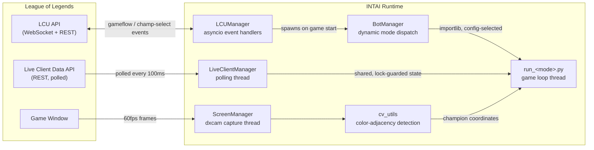
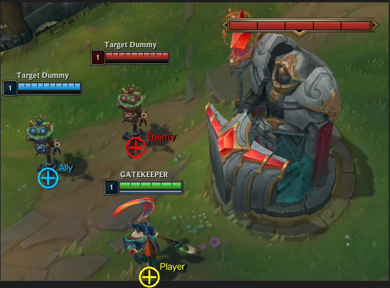
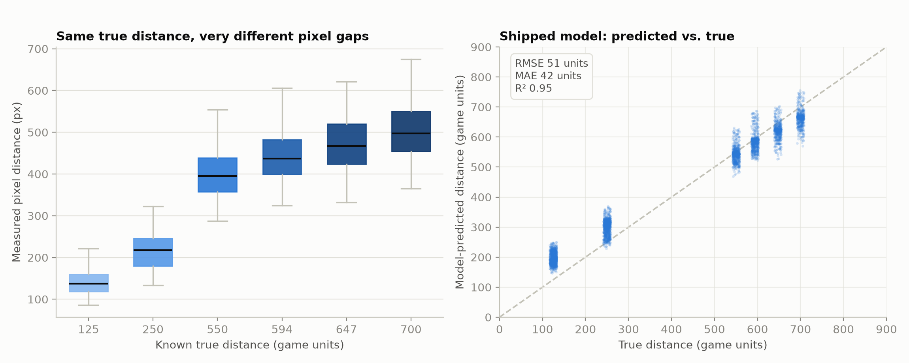

# INTAI

A Windows application that drives League of Legends' client and in-game APIs end-to-end (lobby creation, champion select, and live gameplay) using a real-time computer-vision pipeline built without any ML models or template matching.

> **Note:** This is a personal research project exploring real-time CV, async event-driven systems, and reverse-engineered client APIs. Running this program in a live game environment to automate gameplay violates the League of Legends Terms of Service.

## What it does

INTAI connects to two local League of Legends services and coordinates them through a shared, threaded runtime:

- **League Client Update (LCU) API**: an authenticated WebSocket/REST API exposed by the running client. INTAI subscribes to gameflow and champion-select events to drive lobby creation, matchmaking, ready-check, and pick/ban.
- **Live Client Data API**: a REST endpoint exposed by the game process itself during a match, polled for player/game state (health, level, events).
- **Screen**: captured directly via the GPU (DXGI desktop duplication) since neither API exposes champion positions on screen. A lightweight color-based vision routine locates player, ally, and enemy champions from health-bar pixel signatures in real time.

Those three data sources feed a per-game-mode automation loop (ARAM, Arena, Summoner's Rift) that decides when to attack, retreat, level abilities, shop, and reposition.

## Architecture



Each data source runs on its own thread/event loop and hands off state through locks or events, rather than a shared blocking call chain: the LCU connector, live-data poller, and screen capture never wait on each other, and the per-mode game loop just reads whatever is freshest.

## Key components

### Color-adjacency vision, no ML
[`utils/cv_utils.py`](utils/cv_utils.py) locates champions and most UI elements using a niche image analysis technique: color-adjacency. For example, each health bar has a distinct two-color border (e.g. player/ally/enemy ), so detection reduces to finding pixels of color A directly adjacent to pixels of color B, checked in one pass over the full frame using OpenCV for masking and NumPy for vectorization and a cumulative-sum run-length check. The actual output location is offset by a fixed amount to factor the actual dimensions of the element.

[`tools/run_visualizer.py`](tools/run_visualizer.py) is a debug tool that runs each image detector against the live screen capture and draws a marker at every hit, with per-detector toggles, used to help me test detection accuracy during development.

<p align="center"><em>Original frame</em></p>
<p align="center">
  
</p>

<p align="center"><em>Output frame from detection visualizer</em></p>
<p align="center">
  
</p>


### Screen-space → game-space distance model

**Why this needs a model at all:** the game never exposes world coordinates directly, and pixel distance does not scale linearly with game distance: two champions standing the same true distance apart produce a *different* pixel gap depending on where on screen that happens, because the 3D-to-2D projection is nonlinear (perspective, camera tilt, etc). Raw pixel measurements are useless for game distance calculations until something corrects for that.

[`tools/game_distance_collector.py`](tools/game_distance_collector.py) was used to collect data about on-screen pixel positions while a target sat at one of six known true distances, found from champion attack ranges (125, 250, 550, 594, 647, 700 units). These ranges were tested across many player screen positions and camera angles. [`tools/analyze_game_distances.py`](tools/analyze_game_distances.py) then fit a parametric model against the data (using nonlinear least squares via SciPy):

```
units = pixel_distance × unit_scale × pos_multiplier × sep_multiplier
```

**A hypothesis about League's camera, not a documented fact:** Riot doesn't publish the camera's projection math, so this model is merely a reverse-engineered guess about *why* the projection distorts the way it does.

- **`pos_multiplier`** assumes a fixed pixel gap represents more world distance near the top of the screen (farther away, more foreshortened) than near the bottom (closer to the camera). It interpolates between a `v_top` and `v_bottom` coefficient based on the player's screen-Y position.
- **`sep_multiplier`** assumes that same tilt foreshortens vertical screen separation more than horizontal separation, so the estimate grows multiplicatively the more vertical the gap between two points is.

The fitted coefficients are saved into [`core/constants.py`](core/constants.py) and consumed by `get_game_distance()` / `tether_offset()` in [`utils/game_utils.py`](utils/game_utils.py), letting the bot reason game distance from screen pixels alone. The fit below (RMSE 51 / R² 0.95 against its own calibration data) suggests the hypothesis captures something real about the projection, though it is incomplete as covered in [Future Improvements](#future-improvements).

<p align="center">
  
</p>

<p align="center"><em>Left: the same true distance produces a wide range of pixel separations depending on where on screen it's measured, the reason a position/angle correction is needed at all. Right: the shipped model's predictions against its own calibration data (n=3,658): solid in the middle of the calibrated range, biased at edges (see <a href="#future-improvements">Future Improvements</a>).</em></p>

### Event handling
[`core/LCU_Manager.py`](core/LCU_Manager.py) utilizes `lcu_driver` as a transport layer to manage the connection to the LCU API. INTAI only needs to register handlers for WebSocket events such as changes in the client and game start/end. A gate (`asyncio.Event`) suspends every handler while closed, and events queue up and fire in order once the gate reopens. This ensures no race conditions between handlers.

### Threaded polling with shared state
[`core/live_client_manager.py`](core/live_client_manager.py) runs an isolated polling thread against the Live Client Data endpoint, writing into a `dict` guarded by a `threading.Lock`. Consumers never block the poller and always read/write a consistent snapshot from the dict.

### GPU screen capture
[`core/screen_manager.py`](core/screen_manager.py) wraps `dxcam` (DXGI desktop duplication) for 60 FPS frame capture, decoupling frame production from the detection/decision loop.

### Pluggable config-based scripts
[`core/bot_manager.py`](core/bot_manager.py) dynamically imports the module registered for the active game mode (`core/constants.py`'s `SUPPORTED_MODES`) via `importlib` and runs its `run_game_loop` entry point on its own thread; adding a new mode is a new `core/run_<mode>.py` file plus one constants entry, making development of new modes modular.

## Tech stack

| Area | Tools |
|---|---|
| Language | Python 3.11 |
| Computer vision | OpenCV, NumPy |
| Screen capture | dxcam (DXGI desktop duplication) |
| Client integration | `lcu_driver` (asyncio), `requests` |
| Concurrency | `asyncio`, `threading` (locks, events) |
| Modeling | SciPy (`least_squares`), bounded nonlinear regression |
| Desktop UI | Tkinter |
| Packaging | PyInstaller |
| Windows integration | `pywin32`, `keyboard` |

## Repository layout

```
core/       LCU/live-data managers, screen capture, per-mode game loops, menu UI
utils/      CV routines, game-state helpers, input simulation, config I/O
tools/      Offline data collection + regression fitting for the distance model, detection visualizer
config/     Runtime config (keybinds, selected mode, resolution)
data/       Collected screen/game-distance samples used to fit the projection model
docs/       Notes for extending the module system
```

## Future Improvements

Known issues in the current implementation, and possible fixes:

1. **Distance model has significant error bias toward the shortest and longest distances.** Coverage of screen position is good, but the error is not uniform across that range: at the shortest calibrated distance (125 units) the model **over-predicts by 71 units on average (a 57% relative error)**, and at the longest (700 units) it **under-predicts by ~37 units (~6%)**. The hypothesized parameters for this model could be insufficient or outright wrong. Some other possibilities I could have tried are: horizontal distortion, angular distortion, logarthimic distance scaling, terrain elevation, screen aspect ratio. Intentionally, camera zoom was not considered because in practical use of this tool, there is no reason to use any other zoom other than the default zoom level (max).
2. **Color-adjacency detection is calibrated to one exact display configuration.** The BGR reference values in `core/constants.py` (`HEALTH_LEFT_COLOR`, `PLAYER_HEALTH_RIGHT_COLOR`, etc.) and the tolerances (typically ±1 to 5 per channel, see the `find_*_location` calls in `cv_utils.py`) were sampled only using one machine: under one monitor/GPU color profile and one set of in-game brightness/gamma/colorblind-mode settings. Change any of those (a different monitor, HDR vs. SDR, a colorblind accessibility mode, even GPU-level color vibrance) and the actual on-screen pixel values shift enough that detection can no longer catch the offset and thus fail. A possible fix could be sampling the colors of known elements to determine a machine-wide or game-wide offset. Alternatively, tolerance can be increased, but it is intentionally kept low enough as to detect less false-positives.
