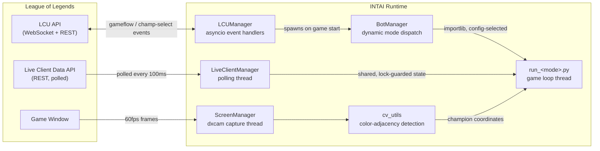

# INTAI

A Windows application that drives League of Legends' client and in-game APIs end-to-end — lobby creation, champion select, and live gameplay — using a real-time computer-vision pipeline built without any ML models or template matching.

> **Note:** This is a personal research project exploring real-time CV, async event-driven systems, and reverse-engineered client APIs. Automating gameplay against Riot's live services violates the League of Legends Terms of Service.

## What it does

INTAI connects to two local League of Legends services and coordinates them through a shared, threaded runtime:

- **League Client Update (LCU) API** — an authenticated WebSocket/REST API exposed by the running client. INTAI subscribes to gameflow and champion-select events to drive lobby creation, matchmaking, ready-check, and pick/ban.
- **Live Client Data API** — a REST endpoint exposed by the game process itself during a match, polled for player/game state (health, level, events).
- **Screen** — captured directly via the GPU (DXGI desktop duplication) since neither API exposes champion positions on screen. A lightweight color-based vision routine locates player, ally, and enemy champions from health-bar pixel signatures in real time.

Those three data sources feed a per-game-mode automation loop (ARAM, Arena, Summoner's Rift) that decides when to attack, retreat, level abilities, shop, and reposition.

## Architecture



Each data source runs on its own thread/event loop and hands off state through locks or events, rather than a shared blocking call chain — the LCU connector, live-data poller, and screen capture never wait on each other, and the per-mode game loop just reads whatever is freshest.

## Key components

### Event-driven LCU integration
[`core/LCU_Manager.py`](core/LCU_Manager.py) wraps `lcu_driver`'s asyncio `Connector`, registering handlers for gameflow-phase and champ-select-session WebSocket events. A gate (`asyncio.Event`) lets the rest of the app pause/resume every handler atomically — used to stop reacting to client events while a match is in progress and cleanly hand off control to the in-game bot thread.

### Threaded polling with shared state
[`core/live_client_manager.py`](core/live_client_manager.py) runs an isolated polling thread against the Live Client Data endpoint, writing into a `dict` guarded by a `threading.Lock`. Consumers never block the poller and always read a consistent snapshot.

### GPU screen capture
[`core/screen_manager.py`](core/screen_manager.py) wraps `dxcam` (DXGI desktop duplication) for lock-free 60 FPS frame capture, decoupling frame production from the detection/decision loop.

### Color-adjacency vision, no ML
[`utils/cv_utils.py`](utils/cv_utils.py) locates champions and UI elements without templates or a trained model. Each health bar has a distinct two-color border (e.g. player/ally/enemy), so detection is reduced to finding pixels of color A directly adjacent to pixels of color B, computed vectorized over the full frame with NumPy/OpenCV masking + a cumulative-sum run-length check — no per-pixel Python loop.

[`tools/run_visualizer.py`](tools/run_visualizer.py) is a standalone, read-only debug overlay that runs each detector against the live screen capture and draws a marker at every hit, with per-detector toggles — used to validate detection accuracy during development without affecting gameplay:

<p align="center">
  
</p>

<p align="center"><em>Output of the same detector functions run against a static test frame — blue/red health bars correctly tagged as ally/enemy, and the green "Gatekeeper" bar tagged as the player.</em></p>

<p align="center">
  
  
</p>

### Screen-space → game-space distance model
The game never exposes world coordinates directly, and the projection from 3D world space to the 2D screen is nonlinear (perspective, camera tilt, variable UI framing). [`tools/game_distance_collector.py`](tools/game_distance_collector.py) captured paired samples of on-screen pixel separation vs. known in-game unit distance; [`tools/analyze_game_distances.py`](tools/analyze_game_distances.py) fits a parametric model (nonlinear least squares via SciPy) over vertical screen position and separation angle, then layers a ridge regression on the residuals for a hybrid estimator — validated with k-fold cross-validation, feature permutation importance, and ablation tests before the final coefficients were baked into [`core/constants.py`](core/constants.py). The resulting `get_game_distance()` / `tether_offset()` functions in [`utils/game_utils.py`](utils/game_utils.py) let the bot reason about attack range and kiting distance from screen pixels alone.

### Pluggable, config-driven modes
[`core/bot_manager.py`](core/bot_manager.py) dynamically imports the module registered for the active game mode (`core/constants.py`'s `SUPPORTED_MODES`) via `importlib` and runs its `run_game_loop` entry point on its own thread — adding a new mode is a new `core/run_<mode>.py` file plus one constants entry, no changes to the orchestration layer.

## Tech stack

| Area | Tools |
|---|---|
| Language | Python 3.11 |
| Computer vision | OpenCV, NumPy |
| Screen capture | dxcam (DXGI desktop duplication) |
| Client integration | `lcu_driver` (asyncio), `requests` |
| Concurrency | `asyncio`, `threading` (locks, events) |
| Modeling | SciPy (`least_squares`), NumPy (ridge regression, k-fold CV) |
| Desktop UI | Tkinter |
| Packaging | PyInstaller |
| Windows integration | `pywin32`, `keyboard` |

## Repository layout

```
core/       LCU/live-data managers, screen capture, per-mode game loops, menu UI
utils/      CV routines, game-state helpers, input simulation, config I/O
tools/      Offline data collection + regression fitting for the distance model, detection visualizer
config/     Runtime config (keybinds, selected mode, resolution)
data/       Collected screen/game-distance samples used to fit the projection model
docs/       Notes for extending the module system
```
